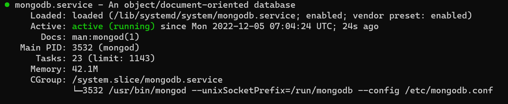

## A simple MEAN Stack Project on Ubuntu
MEAN stands for MongoDB, Express.js, AngularJS, and Node.js. MEAN is an end-to-end JavaScript stack largely used for cloud-ready applications. MEAN is an open source web stack that is mainly used to create cloud-hosted applications. 
1. **MongoDB** (Document database) – Stores and allows retrieval of data.
1. **Express** (Back-end application framework) – Makes requests to Database for Reads and Writes.
1. **Angular** (Front-end application framework) – Handles Client and Server Requests
1. **Node.js** (JavaScript runtime environment) – Accepts requests and displays results to end user


In this tutorial we're going to implement a simple Book Register web form using MEAN stack.

 ## Preparing prerequisites
In order to complete this project you will need an AWS account and a virtual server with Ubuntu Server OS, 20.04 LTS (HVM) image.

## Step 1: Install NodeJs

Update ubuntu

`$sudssh -i "jenkinsdocker.pem" ubuntu@ec2-3-86-205-71.compute-1.amazonaws.como apt update`

Upgrade ubuntu

`$sudo apt upgrade`

Add certificates

`$sudo apt -y install curl dirmngr apt-transport-https lsb-release ca-certificates`
 
`$curl -sL https://deb.nodesource.com/setup_12.x | sudo -E bash -`

Install NodeJS

`$sudo apt install -y nodejs npm express mongoose`

The "-y" flag is a "yes" to answer all default prompts during the installation of these dependencies.

Let’s take a quick look at some of the installed packages:

- npm: a package manager for the NodeJS
- mongoose: A Node.js framework which lets us access MongoDB in an object-oriented way.

Once the installation is done, you can check the Node version with

`$ node --version`
```
Output:

v12.22.12
```
`$ npm --version`
```
Output:

6.14.16
```

## Step 2: Install MongoDB
MongoDB is a non-relational database that stores data in flexible, JSON-like documents. For our example application, we are adding book records to MongoDB that contain book name, isbn number, author, and number of pages.

`$ sudo apt-key adv --keyserver hkp://keyserver.ubuntu.com:80 --recv 0C49F3730359A14518585931BC711F9BA15703C6`
```
Output:

Executing: /tmp/apt-key-gpghome.3OMqavtAhq/gpg.1.sh --keyserver hkp://keyserver.ubuntu.com:80 --recv 0C49F3730359A14518585931BC711F9BA15703C6
gpg: key BC711F9BA15703C6: public key "MongoDB 3.4 Release Signing Key <packaging@mongodb.com>" imported
gpg: Total number processed: 1
gpg:               imported: 1
```

`$ echo "deb [ arch=amd64 ] https://repo.mongodb.org/apt/ubuntu trusty/mongodb-org/3.4 multiverse" | sudo tee /etc/apt/sources.list.d/mongodb-org-3.4.list`
```
Output:

/etc/apt/sources.list.d/mongodb-org-3.4.list
deb [ arch=amd64 ] https://repo.mongodb.org/apt/ubuntu trusty/mongodb-org/3.4 multiverse
```
Install MongoDB

` $sudo apt install -y mongodb`

Start The server

`$sudo service mongodb start`

Verify that the service is up and running

`$sudo systemctl status mongodb`



Install npm – Node package manager.

`$ sudo apt install -y npm`

Install body-parser package
We need ‘body-parser’ package to help us process JSON files passed in requests to the server.

`$ sudo npm install body-parser`

>It's important to not that 'body-parser' has been depreacted in Node version > 4.0 (This explains the warnings you get when you run 'node server.js'). To be replaced by a more functional express.json which help parse our json files and even more. We won't delve into the implementation as this is just a simple tutorial

Next, create a folder named ‘Books’

`$ mkdir Books && cd Books`

In the Books directory,initialize node and the package manager with:

`$ npm init -y`

You should end up with a package.json file that looks like this:
```
Output:

{
  "name": "ubuntu",
  "version": "1.0.0",
  "description": "",
  "main": "index.js",
  "dependencies": {
    "body-parser": "^1.20.1"
  },
  "devDependencies": {},
  "scripts": {
    "test": "echo \"Error: no test specified\" && exit 1"
  },
  "author": "",
  "license": "ISC"
}
```

Add a file to it named server.js
`$ vi server.js`
Copy and paste the web server code below into the server.js file.
```
var express = require('express');
var bodyParser = require('body-parser');
var app = express();
app.use(express.static(__dirname + '/public'));
app.use(bodyParser.json());
require('./apps/routes')(app);
app.set('port', 3300);
app.listen(app.get('port'), function() {
    console.log('Server up: http://localhost:' + app.get('port'));
});
```

## Step 3: Install Express and set up routes to the server
*Express* is a minimal and flexible Node.js web application framework that provides features for web and mobile applications. We will use Express to pass book information to and from our MongoDB database.

We also will use *Mongoose* package which provides a straightforward, schema-based solution to model your application data. We will use Mongoose to establish a schema for the database to store data of our book register.

`$ sudo npm install express mongoose`

In ‘Books’ folder, create a folder named apps

`$ mkdir apps && cd apps`

Create a file named routes.js

`$ vi routes.js`
 
 
Copy and paste the code below into routes.js
```
var Book = require('./models/book');
module.exports = function(app) {
  app.get('/book', function(req, res) {
    Book.find({}, function(err, result) {
      if ( err ) throw err;
      res.json(result);
    });
  }); 
  app.post('/book', function(req, res) {
    var book = new Book( {
      name:req.body.name,
      isbn:req.body.isbn,
      author:req.body.author,
      pages:req.body.pages
    });
    book.save(function(err, result) {
      if ( err ) throw err;
      res.json( {
        message:"Successfully added book",
        book:result
      });
    });
  });
  app.delete("/book/:isbn", function(req, res) {
    Book.findOneAndRemove(req.query, function(err, result) {
      if ( err ) throw err;
      res.json( {
        message: "Successfully deleted the book",
        book: result
      });
    });
  });
  var path = require('path');
  app.get('*', function(req, res) {
    res.sendfile(path.join(__dirname + '/public', 'index.html'));
  });
};
```

In the **‘apps’** folder, create a folder named models

`$ mkdir models && cd models`
Create a file named book.js

`$vi book.js`

Copy and paste the code below into ‘book.js’
```
var mongoose = require('mongoose');
var dbHost = 'mongodb://localhost:27017/test';
mongoose.connect(dbHost);
mongoose.connection;
mongoose.set('debug', true);
var bookSchema = mongoose.Schema( {
  name: String,
  isbn: {type: String, index: true},
  author: String,
  pages: Number
});
var Book = mongoose.model('Book', bookSchema);
module.exports = mongoose.model('Book', bookSchema);
```


